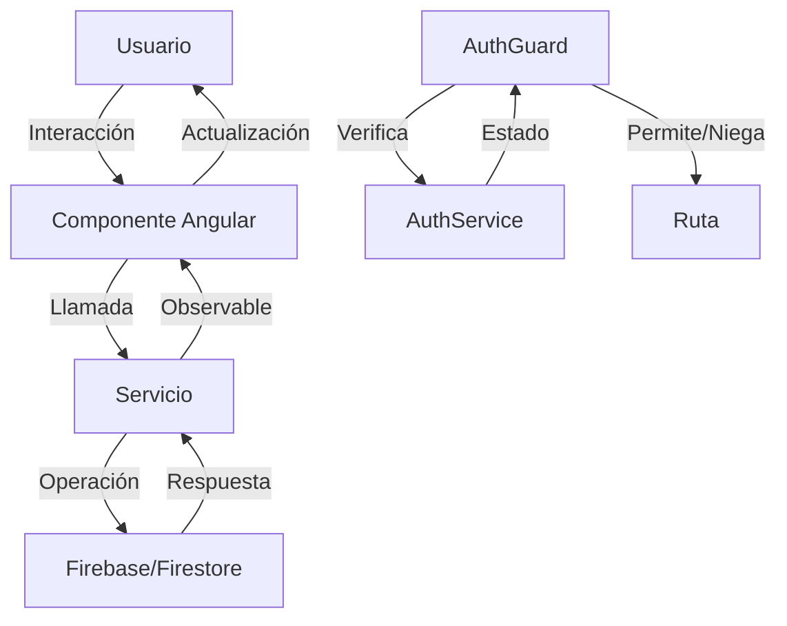

# 📊 Sistema de Facturación

**Desarrollado por:** MAUCAYLLE CHIRCCA, YUNIOR YULIÑO

## 📋 Descripción del Proyecto

Sistema de Facturación es una aplicación web moderna y completa desarrollada con Angular 20 que permite gestionar de forma eficiente todo el proceso de facturación empresarial. La aplicación incluye gestión de clientes, creación y administración de facturas, visualización de estadísticas en tiempo real, todo respaldado por Firebase como backend.

### ✨ Características Principales

- 🔐 **Autenticación segura** con Firebase Authentication
- 👥 **Gestión completa de clientes** (crear, editar, eliminar, visualizar)
- 🧾 **Administración de facturas** con detalles de productos y cálculos automáticos
- 📊 **Panel de estadísticas** con métricas en tiempo real
- 🔍 **Búsqueda y filtrado** de registros
- ⚡ **Actualizaciones en tiempo real** con Firestore
- 📱 **Diseño responsive** y moderno
- ✅ **Validaciones de formularios** robustas

---

## 🛠️ Tecnologías y Herramientas Utilizadas

### Frontend
- **Angular 20.3.0** - Framework principal
- **TypeScript 5.9.2** - Lenguaje de programación
- **RxJS 7.8.0** - Programación reactiva
- **Angular Router** - Navegación y rutas
- **Angular Forms** - Manejo de formularios reactivos

### Backend y Base de Datos
- **Firebase 11.10.0** - Backend as a Service
- **Firebase Authentication** - Autenticación de usuarios
- **Firestore** - Base de datos NoSQL en tiempo real
- **@angular/fire 20.0.1** - Integración Angular-Firebase

### Herramientas de Desarrollo
- **Angular CLI 20.3.6** - Herramienta de línea de comandos
- **Jasmine & Karma** - Testing
- **Prettier** - Formateo de código
- **TypeScript Compiler** - Compilación

---

## 📦 Requisitos e Instalación

### Prerrequisitos

- **Node.js** (versión 18 o superior)
- **npm** (versión 9 o superior)
- **Angular CLI** (versión 20 o superior)
- Cuenta de **Firebase** con proyecto configurado

### Instalación

1. **Clonar el repositorio**
```bash
git clone https://github.com/samael137/S_Facturacion.git
cd S_Facturacion
```

2. **Instalar dependencias**
```bash
npm install
```

3. **Configurar Firebase** (Opcional - ya configurado)
   
   El proyecto ya incluye la configuración de Firebase en `src/app/app.config.ts`. Si deseas usar tu propio proyecto Firebase:
   - Crear proyecto en [Firebase Console](https://console.firebase.google.com/)
   - Habilitar Authentication (Email/Password)
   - Crear base de datos Firestore
   - Actualizar las credenciales en `app.config.ts`

4. **Ejecutar la aplicación en modo desarrollo**
```bash
npm start
# o
ng serve
```

La aplicación estará disponible en `http://localhost:4200/`

5. **Compilar para producción**
```bash
npm run build
# o
ng build
```

Los archivos compilados estarán en el directorio `dist/`

---

## 🏗️ Arquitectura del Proyecto

### Estructura de Carpetas

```
src/app/
├── core/                    # Funcionalidades centrales
│   └── guards/             # Guards de autenticación
│       └── auth-guard.ts   # Protección de rutas privadas
│
├── models/                 # Interfaces y modelos de datos
│   ├── usuario.ts         # Modelo de usuario
│   ├── cliente.ts         # Modelo de cliente
│   ├── factura.ts         # Modelo de factura
│   └── producto.ts        # Modelo de producto
│
├── services/              # Servicios de la aplicación
│   ├── auth.ts           # Servicio de autenticación
│   ├── clientes.ts       # Servicio de gestión de clientes
│   ├── facturas.ts       # Servicio de gestión de facturas
│   ├── firestore.ts      # Servicio genérico de Firestore
│   └── toast.ts          # Servicio de notificaciones
│
├── features/             # Módulos funcionales
│   ├── auth/            # Autenticación
│   │   ├── login/       # Componente de inicio de sesión
│   │   └── register/    # Componente de registro
│   │
│   ├── dashboard/       # Panel principal
│   │
│   ├── estadisticas/    # Estadísticas y métricas
│   │
│   ├── clientes/        # Gestión de clientes
│   │   ├── lista-clientes/    # Listado de clientes
│   │   ├── crear-cliente/     # Crear nuevo cliente
│   │   ├── editar-cliente/    # Editar cliente existente
│   │   └── detalle-cliente/   # Ver detalles del cliente
│   │
│   └── facturas/        # Gestión de facturas
│       ├── lista-facturas/    # Listado de facturas
│       ├── crear-factura/     # Crear nueva factura
│       ├── editar-factura/    # Editar factura existente
│       └── detalle-factura/   # Ver detalles de factura
│
└── shared/              # Componentes y utilidades compartidas
    ├── components/      # Componentes reutilizables
    │   ├── navbar/     # Barra de navegación
    │   ├── loading/    # Indicador de carga
    │   ├── toast/      # Notificaciones
    │   └── not-found/  # Página 404
    │
    ├── pipes/          # Pipes personalizados
    │   ├── currency-format-pipe.ts  # Formato de moneda
    │   ├── ruc-format-pipe.ts       # Formato de RUC
    │   └── estado-badge-pipe.ts     # Estado visual
    │
    └── directives/     # Directivas personalizadas
        └── highlight.ts # Resaltado de elementos
```

### Componentes Principales

#### 🔐 **Módulo de Autenticación**
- **Login:** Inicio de sesión con email y contraseña
- **Register:** Registro de nuevos usuarios
- **AuthService:** Gestión de estado de autenticación
- **AuthGuard:** Protección de rutas para usuarios autenticados

#### 👥 **Módulo de Clientes**
- **Lista de Clientes:** Visualización con búsqueda y filtros
- **Crear Cliente:** Formulario con validaciones (RUC, email, teléfono)
- **Editar Cliente:** Modificación de datos existentes
- **Detalle Cliente:** Vista completa de información del cliente
- **ClientesService:** Operaciones CRUD en Firestore

#### 🧾 **Módulo de Facturas**
- **Lista de Facturas:** Visualización ordenada por fecha
- **Crear Factura:** Formulario con productos dinámicos y cálculos automáticos
- **Editar Factura:** Modificación de facturas existentes
- **Detalle Factura:** Vista completa con productos y totales
- **FacturasService:** Gestión de facturas en Firestore

#### 📊 **Módulo de Estadísticas**
- Resumen de facturas totales
- Cálculo de ingresos
- Métricas de clientes activos
- Gráficos visuales (opcional)

#### 🧩 **Servicios Core**
- **FirestoreService:** Servicio genérico para operaciones CRUD
- **ToastService:** Notificaciones al usuario
- **AuthService:** Autenticación y gestión de sesión

### Flujo de Datos



### Sistema de Rutas

- **Rutas Públicas:** `/login`, `/register`
- **Rutas Protegidas** (requieren autenticación):
  - `/dashboard` - Panel principal
  - `/estadisticas` - Estadísticas
  - `/clientes` - Gestión de clientes
  - `/clientes/crear` - Crear cliente
  - `/clientes/editar/:id` - Editar cliente
  - `/clientes/detalle/:id` - Ver cliente
  - `/facturas` - Gestión de facturas
  - `/facturas/crear` - Crear factura
  - `/facturas/editar/:id` - Editar factura
  - `/facturas/detalle/:id` - Ver factura

---

## 🌐 Deploy en Firebase Hosting

### URL de la Aplicación Desplegada

🔗 **[https://sistema-facturacion-cd4c1.web.app](https://sistema-facturacion-cd4c1.web.app)**

> ⚠️ **Nota:** Reemplaza esta URL con la URL real de Firebase Hosting después del despliegue.

### Pasos para Desplegar

```bash
# 1. Instalar Firebase CLI
npm install -g firebase-tools

# 2. Iniciar sesión en Firebase
firebase login

# 3. Inicializar Firebase en el proyecto
firebase init

# 4. Compilar la aplicación
npm run build

# 5. Desplegar
firebase deploy
```

---

## 🎥 Video Demostrativo

### 📹 Enlace al Video
🔗 **[Video Demostrativo del Sistema (5-8 minutos)](https://TU-ENLACE-DE-VIDEO.com)**

> ⚠️ **Nota:** Reemplaza este enlace con la URL real de tu video en YouTube, Google Drive, o plataforma de tu preferencia.

### Contenido del Video

El video de demostración incluye:

1. **Introducción al Sistema** (30 seg)
   - Presentación general de la aplicación
   - Tecnologías utilizadas

2. **Flujo de Autenticación** (1-2 min)
   - Registro de nuevo usuario
   - Inicio de sesión
   - Cierre de sesión
   - Protección de rutas

3. **Gestión de Clientes** (1-2 min)
   - Crear nuevo cliente
   - Listar clientes
   - Buscar y filtrar
   - Editar cliente
   - Ver detalles
   - Eliminar cliente

4. **Gestión de Facturas** (2-3 min)
   - Crear nueva factura
   - Agregar productos
   - Cálculos automáticos
   - Guardar en Firestore
   - Listar facturas
   - Ver detalles de factura
   - Editar y actualizar

5. **Estadísticas** (30 seg - 1 min)
   - Vista de dashboard
   - Métricas principales
   - Datos en tiempo real

6. **Explicación del Código** (1-2 min)
   - Estructura de componentes
   - Servicios principales
   - AuthGuard
   - Integración con Firebase
   - Manejo de estados y observables

---

## 📖 Manual de Usuario

### 1. Inicio de Sesión y Registro

#### Crear una Cuenta Nueva

1. Abre la aplicación en tu navegador
2. Haz clic en **"Registrarse"** o **"Crear cuenta"**
3. Completa el formulario:
   - **Nombre completo**
   - **Correo electrónico**
   - **Contraseña** (mínimo 6 caracteres)
   - **Confirmar contraseña**
4. Haz clic en **"Registrarse"**
5. Serás redirigido automáticamente al dashboard

#### Iniciar Sesión

1. En la página de inicio, ingresa:
   - **Correo electrónico**
   - **Contraseña**
2. Haz clic en **"Iniciar Sesión"**
3. Accederás al panel principal

#### Cerrar Sesión

1. Haz clic en tu perfil o menú de usuario en la barra de navegación
2. Selecciona **"Cerrar Sesión"**

---

### 2. Gestión de Clientes

#### Crear un Nuevo Cliente

1. Ve a **"Clientes"** en el menú de navegación
2. Haz clic en **"Nuevo Cliente"** o **"+"**
3. Completa el formulario:
   - **Nombre/Razón Social** (obligatorio)
   - **RUC** (11 dígitos, obligatorio)
   - **Dirección**
   - **Teléfono**
   - **Correo electrónico**
4. Haz clic en **"Guardar"**
5. El cliente aparecerá en la lista

#### Listar y Buscar Clientes

1. Ve a **"Clientes"**
2. Verás la lista completa de clientes
3. Usa la barra de búsqueda para filtrar por:
   - Nombre
   - RUC
   - Correo
4. Los resultados se actualizan en tiempo real

#### Editar un Cliente

1. En la lista de clientes, haz clic en el botón **"Editar"** (icono de lápiz)
2. Modifica los campos necesarios
3. Haz clic en **"Guardar Cambios"**

#### Ver Detalles de un Cliente

1. En la lista, haz clic en **"Ver Detalles"** o en el nombre del cliente
2. Verás toda la información del cliente
3. También puedes ver las facturas asociadas a ese cliente (si las hay)

#### Eliminar un Cliente

1. En la lista de clientes, haz clic en **"Eliminar"** (icono de basura)
2. Confirma la acción en el diálogo de confirmación
3. El cliente se eliminará permanentemente

---

### 3. Gestión de Facturas

#### Crear una Nueva Factura

1. Ve a **"Facturas"** en el menú
2. Haz clic en **"Nueva Factura"** o **"+"**
3. Completa los datos principales:
   - **Seleccionar Cliente** (desplegable)
   - **Número de Factura** (generado automáticamente o manual)
   - **Fecha de Emisión**
   - **Fecha de Vencimiento**
4. **Agregar Productos:**
   - Haz clic en **"Agregar Producto"**
   - Completa:
     - Nombre del producto
     - Cantidad
     - Precio unitario
   - El **subtotal se calcula automáticamente**
   - Puedes agregar múltiples productos
5. **Revisar Totales:**
   - Subtotal (suma de todos los productos)
   - IGV (18%)
   - Total General
6. Haz clic en **"Guardar Factura"**

#### Listar Facturas

1. Ve a **"Facturas"**
2. Verás todas las facturas ordenadas por fecha
3. Puedes ver:
   - Número de factura
   - Cliente
   - Fecha
   - Estado (Pagada, Pendiente, Vencida)
   - Total

#### Buscar y Filtrar Facturas

1. Usa la barra de búsqueda para filtrar por:
   - Número de factura
   - Nombre de cliente
   - Fecha
2. Usa filtros adicionales:
   - **Estado:** Todas, Pagadas, Pendientes, Vencidas
   - **Rango de fechas**

#### Ver Detalles de una Factura

1. En la lista, haz clic en **"Ver Detalles"** o en el número de factura
2. Verás:
   - Información del cliente
   - Listado completo de productos
   - Cálculos (subtotal, IGV, total)
   - Fechas
   - Estado
3. Desde aquí puedes:
   - Imprimir (función futura)
   - Descargar PDF (función futura)
   - Editar
   - Eliminar

#### Editar una Factura

1. En los detalles de la factura, haz clic en **"Editar"**
2. Modifica los datos necesarios
3. Puedes:
   - Cambiar el cliente
   - Agregar/eliminar productos
   - Modificar cantidades y precios
   - Actualizar fechas
4. Haz clic en **"Guardar Cambios"**

#### Eliminar una Factura

1. En los detalles o en la lista, haz clic en **"Eliminar"**
2. Confirma la acción
3. La factura se eliminará de Firestore

---

### 4. Dashboard y Estadísticas

#### Panel Principal (Dashboard)

1. Al iniciar sesión, verás el dashboard con:
   - **Resumen rápido:**
     - Total de clientes
     - Total de facturas
     - Facturas pendientes
     - Ingreso total
   - **Facturas recientes**
   - **Gráficos visuales** (opcional)

#### Vista de Estadísticas

1. Ve a **"Estadísticas"** en el menú
2. Verás análisis detallados:
   - **Ingresos por período:**
     - Hoy
     - Esta semana
     - Este mes
     - Este año
   - **Estado de facturas:**
     - Pagadas
     - Pendientes
     - Vencidas
   - **Clientes más frecuentes**
   - **Productos más vendidos** (si aplica)
3. Los datos se actualizan en tiempo real

---

### 5. Características Adicionales

#### Notificaciones Toast

- El sistema muestra notificaciones temporales para:
  - ✅ Operaciones exitosas (verde)
  - ❌ Errores (rojo)
  - ⚠️ Advertencias (amarillo)
  - ℹ️ Información (azul)

#### Validaciones de Formularios

Todos los formularios incluyen validaciones:
- **Campos obligatorios:** marcados con asterisco (*)
- **Formato de RUC:** debe tener 11 dígitos
- **Formato de email:** debe ser válido
- **Contraseñas:** mínimo 6 caracteres
- **Números:** solo valores positivos
- Se muestran mensajes de error bajo cada campo

#### Búsqueda en Tiempo Real

- Las búsquedas filtran los resultados mientras escribes
- No necesitas presionar "Enter" o botón de búsqueda

#### Actualización Automática

- Los datos se sincronizan automáticamente con Firestore
- Si otro usuario hace cambios, verás las actualizaciones en tiempo real
- No necesitas refrescar la página

---

### 6. Solución de Problemas Comunes

#### No Puedo Iniciar Sesión

- Verifica que tu correo y contraseña sean correctos
- Asegúrate de tener conexión a internet
- Si olvidaste tu contraseña, usa la opción "Recuperar contraseña" (si está implementada)

#### Los Datos No se Guardan

- Verifica tu conexión a internet
- Asegúrate de completar todos los campos obligatorios
- Revisa que no haya errores de validación en el formulario

#### La Aplicación Está Lenta

- Verifica tu conexión a internet
- Cierra otras pestañas del navegador
- Actualiza la página (F5)
- Limpia la caché del navegador

#### No Veo las Facturas/Clientes

- Asegúrate de haber iniciado sesión
- Verifica que tengas permisos adecuados
- Los datos pueden tardar unos segundos en cargar

---

### 7. Buenas Prácticas

✅ **Recomendaciones:**

- Cierra sesión cuando termines de usar la aplicación
- Usa contraseñas seguras (combinación de letras, números y símbolos)
- Verifica los datos antes de guardar facturas
- Mantén actualizada la información de tus clientes
- Revisa regularmente las estadísticas
- Haz respaldo de información importante

❌ **Evita:**

- Compartir tus credenciales de acceso
- Dejar la sesión abierta en computadoras públicas
- Eliminar registros sin verificar
- Crear facturas con información incorrecta

---
